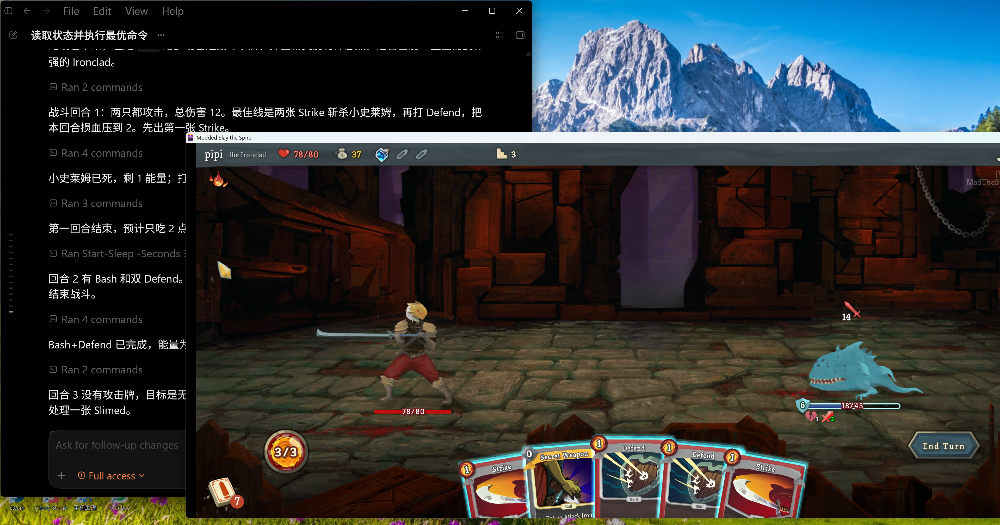

# Slay the Spire Agent Bridge

用 AI Agent 自动游玩《杀戮尖塔》的本地桥接项目。它把 CommunicationMod 提供的游戏状态转换成 HTTP API，让 Codex 或其他 AI Agent 可以读取局面、分析策略，并向游戏提交下一条操作命令。

> 本项目是非官方个人项目，不隶属于 Slay the Spire、Mega Crit、ModTheSpire、BaseMod 或 CommunicationMod。



截图展示了 Codex 读取游戏状态、分析下一步，并通过本地 bridge 向《杀戮尖塔》发送操作命令。

## 核心功能

- 通过 CommunicationMod 读取《杀戮尖塔》的结构化状态。
- 提供本地 HTTP API，供 Codex 或其他 AI Agent 控制游戏。
- 生成适合 Agent 决策的精简上下文：`/api/codex_context`。
- 提供本地网页控制台：`http://127.0.0.1:8787`。
- 将运行日志、最新状态和命令历史写入 `run/`，方便调试和复盘。
- 内置 Codex Skill，约束 Agent 一次只执行一条合法命令。

核心链路：

```text
Slay the Spire
  -> ModTheSpire + BaseMod + CommunicationMod
  -> agent_bridge.py stdin/stdout protocol
  -> http://127.0.0.1:8787
  -> Codex / other AI agent / web controller
```

## 环境要求

- Windows、macOS 或 Linux。
- Python 3.9+。当前实现只使用 Python 标准库。
- Slay the Spire。
- ModTheSpire、BaseMod、Communication Mod。

Steam Workshop 推荐订阅：

- [ModTheSpire](https://steamcommunity.com/workshop/filedetails/?id=1605060445)
- BaseMod
- [Communication Mod](https://steamcommunity.com/workshop/filedetails/?id=2131373661)

启动游戏时选择 `Play With Mods`，并勾选：

```text
BaseMod
Communication Mod
```

## 安装与启动

克隆项目：

```powershell
git clone https://github.com/zkwi/slay-spire-agent-bridge.git
cd slay-spire-agent-bridge
```

配置 CommunicationMod。配置文件通常位于：

```text
%LOCALAPPDATA%\ModTheSpire\CommunicationMod\config.properties
```

推荐配置：

```properties
verbose=true
maxInitializationTimeout=30
command=<python.exe> <project>\\agent_bridge.py
runAtGameStart=true
```

Windows 示例：

```properties
command=C\:\\Path\\To\\Python\\python.exe C\:\\Path\\To\\slay-spire-agent-bridge\\agent_bridge.py
```

注意：

- `command` 必须指向 Python 解释器和 `agent_bridge.py`。
- Java properties 里 Windows 路径的 `\` 通常需要写成 `\\`，盘符冒号可写成 `C\:`。
- 路径里有空格时更容易出错，尽量使用无空格路径。
- 修改 Python 文件后，已经运行的 bridge 不会热加载，需要重启游戏或 ModTheSpire。

启动成功后，浏览器打开：

```text
http://127.0.0.1:8787
```

也可以用 PowerShell 验证：

```powershell
(Invoke-WebRequest -Uri 'http://127.0.0.1:8787/api/summary' -TimeoutSec 5).Content
```

## 在 Codex 中使用

项目内置 Codex Skill：

```text
skills/slay-spire-bridge/SKILL.md
```

如果需要安装到 Codex：

```powershell
Copy-Item -Recurse -Force `
  '.\skills\slay-spire-bridge' `
  "$env:USERPROFILE\.codex\skills\slay-spire-bridge"
```

基本控制循环：

```text
读取 GET /api/codex_context
  -> 从 suggested_commands 选择一条命令
  -> POST /api/command
  -> 等待状态变化后重新读取
```

读取状态：

```powershell
(Invoke-WebRequest -Uri 'http://127.0.0.1:8787/api/codex_context' -TimeoutSec 5).Content
```

提交命令：

```powershell
$body = @{
  command = 'choose 1'
  source = 'codex'
  reason = 'Choose the strongest offered card.'
} | ConvertTo-Json -Compress

Invoke-RestMethod `
  -Uri 'http://127.0.0.1:8787/api/command' `
  -Method Post `
  -ContentType 'application/json' `
  -Body $body
```

Agent 规则：

- 每次只提交一条命令。
- 只从 `/api/codex_context` 或 `/api/commands` 的 `suggested_commands` 中选择命令。
- 每次命令后重新读取状态。
- `reason` 简短说明战术原因。
- 不要直接写 CommunicationMod 的 stdin/stdout。
- 不要在主菜单自动开新局，除非用户明确要求。

## 常用 API

```http
GET  /api/codex_context
GET  /api/summary
GET  /api/commands
GET  /api/debug
POST /api/command
POST /api/mode
```

Python 标准库调用示例：

```python
import json
import urllib.request

BASE = "http://127.0.0.1:8787"

context = urllib.request.urlopen(
    BASE + "/api/codex_context",
    timeout=5,
).read().decode("utf-8")

print(context)

payload = json.dumps({
    "command": "end",
    "source": "agent",
    "reason": "No useful playable cards remain.",
}).encode("utf-8")

request = urllib.request.Request(
    BASE + "/api/command",
    data=payload,
    headers={"Content-Type": "application/json"},
    method="POST",
)

print(urllib.request.urlopen(request, timeout=5).read().decode("utf-8"))
```

## 项目结构

```text
agent_bridge.py                         # 主桥接器
skills/slay-spire-bridge/SKILL.md       # Codex / AI Agent 使用的 Skill
skills/slay-spire-bridge/agents/        # Agent 提示词配置
docs/assets/codex-gameplay.png          # README 截图
llm_config.example.json                 # 可选 LLM 配置示例，不含真实密钥
run/                                    # 运行时状态、日志、历史记录，不提交
```

`run/`、`llm_config.local.json`、`.env` 和其他本地配置文件已在 `.gitignore` 中排除。

## 关键策略规则

这些规则写入了项目 Skill，用于减少 AI Agent 的低级失误：

- 战斗中先检查斩杀，再检查本回合是否会受到致命伤害。
- 一次只执行一个动作，执行后重新读取状态。
- 面对交互选择界面时优先使用 `suggested_commands`。
- 牌组奖励只拿真正提升牌组的问题解决牌；普通牌很差时可以跳过。
- 商店优先移除坏牌、购买强遗物或关键牌。
- 低血量时降低精英风险，安全时优先选择成长路线。
- `GAME_OVER` 或 `DEATH` 后不尝试回滚，只等待或由玩家手动回主菜单。

## 调试

常用排查顺序：

1. `GET /api/codex_context`
2. `GET /api/commands`
3. `GET /api/debug`
4. 查看 `run/commands.jsonl`
5. 查看 `run/errors.jsonl`
6. 查看 `run/agent.log`

常见问题：

- `No state received yet`：HTTP 服务启动了，但 CommunicationMod 还没有发送游戏状态。
- 命令入队但游戏不动：检查 `run/commands.jsonl`，确认命令是否从 `queued` 变成 `sent`。
- 一直 `wait 30`：可能处于动画期，也可能交互选择屏幕未被识别，需要看 `screen.type` 和 `suggested_commands`。
- 修改 Python 后行为不变：重启 bridge 或游戏。

## 开发验证

```powershell
python -m py_compile agent_bridge.py
```

完整自测会写入 `run/`，正在跑局时不要随便执行：

```powershell
python agent_bridge.py --self-test
```

发布前建议检查：

```powershell
rg -n "sk-[A-Za-z0-9_-]{20,}|Bearer [A-Za-z0-9_.-]{20,}|\\.env" .
python -m py_compile agent_bridge.py
```

## 安全与隐私

- HTTP 服务默认只监听 `127.0.0.1`。
- 默认不调用外部模型 API。
- 不要提交 `run/`，其中可能包含当前局面、命令历史和调试日志。
- 不要提交 `llm_config.local.json`，其中可能包含模型 API Key。
- 不要提交 `.env`、token、cookie、Authorization header 或个人本机路径。

## 贡献

欢迎提交 issue、文档改进和小而清晰的代码修复。项目以个人使用和快速迭代为主，优先保持实现简单、依赖少、易读易改。

修改建议：

- 优先使用 Python 标准库。
- HTTP API 和 Skill 文档保持一致。
- 修改 CommunicationMod 协议输出相关逻辑时，确认 stdout 只输出协议命令。
- 提交前运行 `python -m py_compile agent_bridge.py`。

## License

MIT License. See [LICENSE](LICENSE).
